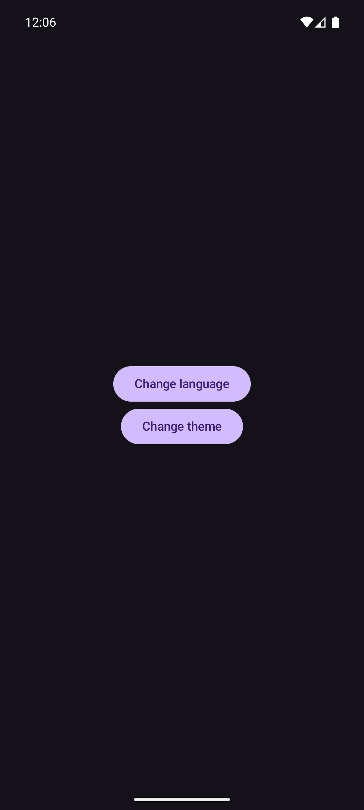
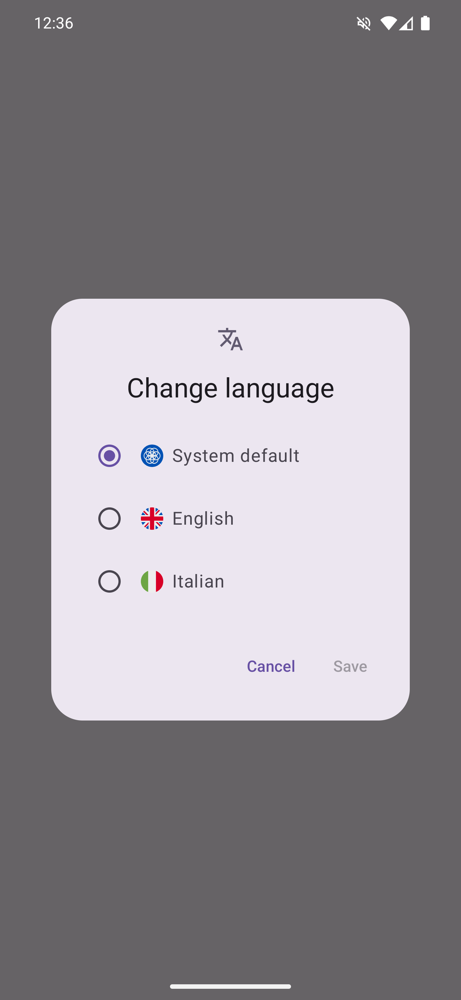
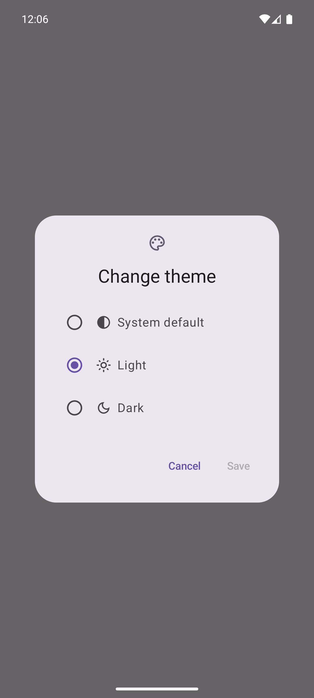

  

# Jetpack Compose Android template
To create you own repo, click on:

> [!IMPORTANT]
> [Here](https://github.com/seve-andre/jetpack-compose-template/wiki#instructions) you can find detailed instructions on how to turn the template into your own app

## What does it use?
- [Kotlin](https://kotlinlang.org/) as main language
- [Jetpack Compose](https://developer.android.com/jetpack/compose) as modern toolkit for native UI
- [Material 3 components for Jetpack Compose](https://developer.android.com/reference/kotlin/androidx/compose/material3/package-summary#top-level-functions) to build UI faster
- [Room](https://developer.android.com/training/data-storage/room) as local persistent DB
- [Retrofit+OkHttp](https://square.github.io/retrofit/): for api calls
- [Proto Datastore](https://developer.android.com/topic/libraries/architecture/datastore?gclid=CjwKCAjwkYGVBhArEiwA4sZLuMMCRUnWZzzy-AwDePYTUTn3gO6-rrT8jGo7D-H2vztegIJ-zEsb8hoCtI8QAvD_BwE&gclsrc=aw.ds) as typesafe data storage solution with protocol buffers support
- [Dagger Hilt](https://developer.android.com/training/dependency-injection/hilt-android) for Dependency Injection
- [Detekt](https://detekt.dev/) for static code analysis and formatting
- [Timber](https://github.com/JakeWharton/timber) for logging
- [Eva icons](https://github.com/DevSrSouza/compose-icons/blob/master/eva-icons/DOCUMENTATION.md) for the icons to use throughout the whole app
- [Coil](https://coil-kt.github.io/coil/compose/) for image loading backed by Kotlin coroutines
- [Splashscreen API](https://developer.android.com/develop/ui/views/launch/splash-screen) to display a splashscreen at app launch
- [Per-app language preferences](https://developer.android.com/guide/topics/resources/app-languages) to use a language inside the app that is different from the system language
- [Compose Destinations](https://composedestinations.rafaelcosta.xyz/) for easier app navigation

## What does it offer?
- ⚫ dark theme support
- 🇬🇧 🇮🇹 in-app language preference
- 🔒 encrypted datastore
- 🔭 linting and formatting on PR
- 🔧 custom snackbars

## Screenshots

  
<strong>Light/dark theme</strong>

  
  

  
<strong>Language and theme pickers</strong>

  
  

### Inspo
- [version catalog](https://github.com/seve-andre/jetpack-compose-template/blob/main/gradle/libs.versions.toml): [see inspo](https://developer.android.com/build/migrate-to-catalogs)
- [Result](https://github.com/seve-andre/jetpack-compose-template/blob/main/app/src/main/kotlin/com/mitch/appname/util/Result.kt): [see inspo](https://github.com/android/nowinandroid/blob/607c24e7f7399942e278af663ea4ad350e5bbc3a/core/common/src/main/java/com/google/samples/apps/nowinandroid/core/result/Result.kt)
- [AppState](https://github.com/seve-andre/jetpack-compose-template/blob/main/app/src/main/kotlin/com/mitch/appname/ui/AppState.kt): [see inspo](https://github.com/android/nowinandroid/blob/607c24e7f7399942e278af663ea4ad350e5bbc3a/app/src/main/java/com/google/samples/apps/nowinandroid/ui/NiaAppState.kt)
- [NetworkMonitor](https://github.com/seve-andre/jetpack-compose-template/blob/main/app/src/main/kotlin/com/mitch/appname/util/network/NetworkMonitor.kt): [see inspo](https://github.com/android/nowinandroid/blob/9371d0d4b80ffea0105a2376d057243eb68af0fa/core/data/src/main/java/com/google/samples/apps/nowinandroid/core/data/util/NetworkMonitor.kt)
- [ConnectivityManagerNetworkMonitor](https://github.com/seve-andre/jetpack-compose-template/blob/main/app/src/main/kotlin/com/mitch/appname/util/network/ConnectivityManagerNetworkMonitor.kt): [see inspo](https://github.com/android/nowinandroid/blob/11fbf53f12898b6ee7c55dda69716fa3600e7317/core/data/src/main/java/com/google/samples/apps/nowinandroid/core/data/util/ConnectivityManagerNetworkMonitor.kt)

> [!NOTE]
> Feel free to contribute or reach out to me at [my email](mailto:andrea.severi.dev@gmail.com?subject=[GitHub]%20Jetpack%20Compose%20Android%20Template)
